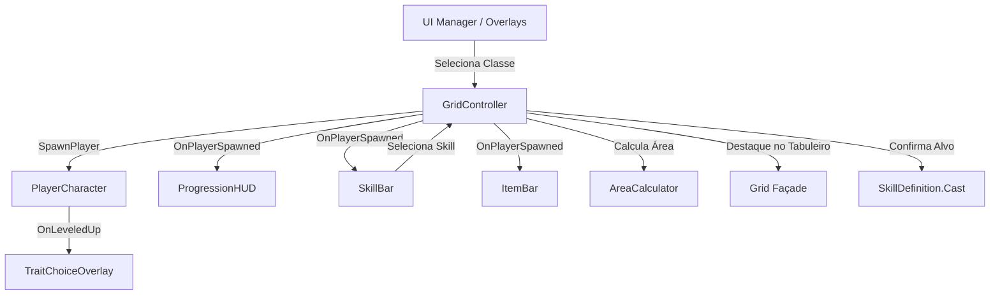

---
tags:
  - plano
  - ui
  - skills
  - items
  - unity
created: 2026-09-07
---

# Plano de Implementação: Fix UI, Skills, Itens e Orquestração

### Overview & Goals
O objetivo deste plano é resolver as pendências críticas de jogabilidade e interface no `GridBattle` em Unity 6 — especificamente a inicialização do jogo (seleção de classe), a exibição e vinculação dos elementos de HUD (Vida, Escudo, XP, Nível), a criação da barra e fluxo de uso de Habilidades (`SkillBar`), o fluxo funcional de itens (`ItemBar`) e a ativação do overlay de escolha de talentos (`TraitChoiceOverlay`) no level up. Além disso, o documento [[plano_migracao_unity]] é atualizado minuciosamente para refletir o estado de implementação atual e servir de guia para sessões futuras.

### Scope
- **In Scope:**
  - Atualização completa de `docs/planos/plano_migracao_unity.md` com o diagnóstico de implementação e guia para próximos modelos.
  - Orquestração de inicialização do jogo com `ClassSelectOverlay` antes do início dos turnos.
  - Conexão automática de `ProgressionHUD` ao `PlayerCharacter` gerado no `GridController`.
  - Implementação de `SkillBar` e `SkillSlot` em `Assets/Application/UI/Scripts/` integrados ao `SkillComponent`.
  - Implementação do modo de mira e confirmação de alvo (targeting) no `GridController` para skills e itens com formas geométricas de `AreaCalculator`.
  - Disparo de `TraitChoiceOverlay` ao subir de nível via `Experience.OnLeveledUp` e `TraitSheet.GetEligibleTraits`.
  - Conexão de `ItemBar` para recebimento e uso de consumíveis/ativos.

- **Out of Scope:**
  - Criação de novos tipos de entidades ou inimigos além dos já existentes no código.
  - Backend, salvamento em nuvem ou configurações de áudio/haptics adicionais.

### User Stories
- **Como jogador**, ao iniciar a partida, quero escolher minha classe inicial para que os atributos e sprites corretos sejam aplicados ao meu personagem.
- **Como jogador**, quero visualizar minha barra de vida, escudo, nível e barra de progresso de XP na HUD para acompanhar minha evolução em tempo real.
- **Como jogador**, quero visualizar minhas skills ativas e seus tempos de recarga em uma barra dedicada para utilizá-las taticamente durante a partida.
- **Como jogador**, quero tocar em um item ou skill e ver o destaque da área de efeito no tabuleiro antes de confirmar a ativação.
- **Como jogador**, ao subir de nível, quero que a tela de seleção de traits seja aberta automaticamente com 3 opções válidas para escolher meu upgrade.

### Functional Requirements
1. **Fluxo de Inicialização:**
   - Na inicialização da cena `Main.unity`, o `GridController` deve abrir o `ClassSelectOverlay` e aguardar a seleção do jogador antes de spawnar o personagem e popular o tabuleiro.
2. **ProgressionHUD:**
   - Deve receber a referência do jogador recém-criado via evento `OnPlayerSpawned` e sincronizar sliders e textos de Vida, Escudo, Nível e XP.
3. **SkillBar & Slots de Habilidade:**
   - Componentes UI que exibem ícone, estado de prontidão e número de turnos restantes de cooldown para cada habilidade do `SkillComponent`.
4. **Sistema de Mira (Targeting):**
   - Ao tocar em uma skill pronta ou item na barra, o jogo entra em modo de seleção de alvo, destacando as células afetadas com base no `AreaShape` e alcance.
   - Tocar em uma célula válida executa a habilidade/item e consome o turno/cooldown; tocar fora ou no próprio botão cancela a mira.
5. **Level Up & Trait Choice:**
   - Ao atingir XP suficiente, `Experience.OnLeveledUp` dispara uma pausa na interação (`InputLocked = true`) e abre `TraitChoiceOverlay.PresentChoices` com traits da classe.

# Technical Design

### Current Implementation
- **Core do Grid (`Grid.cs`, `GridController.cs`)**: Fachada de grid e movimentação em cascata implementados e funcionais com LitMotion.
- **Personagem e Progressão (`PlayerCharacter.cs`, `Health.cs`, `Stats.cs`, `Experience.cs`, `TraitSheet.cs`, `SkillComponent.cs`)**: Classes e dados base implementados, com eventos de level up e spawn conectados à camada de interface.
- **UI (`ProgressionHUD.cs`, `ClassSelectOverlay.cs`, `TraitChoiceOverlay.cs`, `ItemBar.cs`, `ItemSlot.cs`, `SkillBar.cs`, `SkillSlot.cs`)**: Scripts implementados e orquestrados pelo `GridController`.
- **Modo de Mira**: Suporte a mira visual com `AreaCalculator` implementado no `GridController`.

### Key Decisions
1. **Orquestração via GridController & Eventos Desacoplados**:
   - *Decisão*: O `GridController` emite eventos do ciclo de jogo (`OnPlayerSpawned`, `OnPlayerDied`, `OnLevelUpPrompt`) e gerencia o estado de mira sem acoplamento direto com prefabs visuais de UI.
   - *Motivo*: Mantém o princípio de Fachada Única e SRP estabelecido nas diretrizes arquiteturais.

2. **Reaproveitamento do Pipeline de Área para Skills e Itens**:
   - *Decisão*: Utilizar `AreaCalculator.GetAffectedPositions` diretamente no modo de mira do `GridController` para acionar `Grid.SetHighlightedPositions`.
   - *Motivo*: Evita duplicação de lógica espacial entre itens consumíveis e habilidades ativas.

### Architecture Diagram

### Proposed Changes

#### 1. Orquestração e Inicialização (`GridController.cs`)
- Adicionado suporte ao fluxo de início com `ClassSelectOverlay`:
  - Se configurado, apresenta o seletor antes de spawnar o jogador.
- Integrado modo de mira (`_isTargeting`, `_currentActiveSkill`, `_currentActiveItem`):
  - Ao clicar em skill/item, destaca posições via `_grid.SetHighlightedPositions(...)`.
  - Ao tocar em célula válida, resolve dano/efeito e decrementa cooldowns via `NotifyPlayerActed()`.
- Escuta `Experience.OnLeveledUp` do jogador para invocar `TraitChoiceOverlay.PresentChoices()`.

#### 2. Barra e Slots de Skills (`SkillBar.cs`, `SkillSlot.cs`)
- `SkillSlot.cs` em `Assets/Application/UI/Scripts/`:
  - Exibe ícone da skill, overlay escurecido de cooldown e texto com turnos restantes.
  - Evento de clique para notificar a `SkillBar`.
- `SkillBar.cs` em `Assets/Application/UI/Scripts/`:
  - Vincula-se ao `SkillComponent` do jogador e ao `GridController`.
  - Atualiza os slots quando `OnSkillsChanged` ou `OnCooldownsChanged` forem disparados.

#### 3. Atualização da Documentação (`docs/planos/plano_migracao_unity.md`)
- Matriz completa de componentes atualizada (todos os módulos de UI, Skills e Mira marcados como Concluído).
- Descrição da infraestrutura de UI e do modo de mira.
- Guia de continuidade para agentes e desenvolvedores subsequentes.

### File Structure
- **Criados:**
  - `Assets/Application/UI/Scripts/SkillSlot.cs`
  - `Assets/Application/UI/Scripts/SkillBar.cs`
  - `docs/planos/plano_fix_ui_skills_items.md`
- **Modificados:**
  - `Assets/Application/Grid/Scripts/GridController.cs`
  - `Assets/Application/UI/Scripts/ProgressionHUD.cs`
  - `Assets/Application/UI/Scripts/ItemBar.cs`
  - `docs/planos/plano_migracao_unity.md`

### Risks & Mitigations
- **Risco:** Conflito entre toque para andar/atacar e toque para disparar skill/item.
  - *Mitigação:* `_isTargeting` intercepta o `HandleCellTapped` no `GridController`, priorizando a resolução da habilidade e cancelando com toque fora da área válida.

# Testing

### Validation Approach
A validação é realizada por meio de testes unitários existentes e verificação dos fluxos de eventos do ciclo de vida no Unity.

### Key Scenarios
1. **Seleção de Classe:**
   - Iniciar o jogo sem classe padrão -> `ClassSelectOverlay` é exibido.
   - Clicar em uma classe -> `PlayerCharacter` é instanciado com atributos e sprite corretos, e o grid é populado.
2. **Atualização da HUD:**
   - Receber dano -> slider e texto de vida diminuem no `ProgressionHUD`.
   - Adicionar escudo -> texto de escudo (+N) aparece.
   - Ganhar XP -> slider de XP atualiza; ao atingir o limite, nível incrementa e `TraitChoiceOverlay` é aberto.
3. **Uso de Skills:**
   - Habilidade exibida no `SkillBar` com cooldown 0 pronta para uso.
   - Clicar na skill -> grid destaca a área de efeito (`AreaCalculator`).
   - Clicar na célula alvo -> dano aplicado aos inimigos, turno avança e cooldown é ativado.
4. **Uso de Itens:**
   - Item adicionado ao `ItemBar`.
   - Clicar no slot de item -> ativação / mira e consumo correto do item no slot.

### Edge Cases
- Tentativa de usar skill em cooldown (botão desabilitado).
- Cancelamento de mira ao tocar no próprio botão da skill ou fora do grid.
- Morte do jogador durante a seleção de traits ou no meio de um turno (garantir que `GameOverDialog` trave a entrada).

# Delivery Steps

### ✓ Step 1: Auditar e Atualizar Plano de Migração
Atualizar detalhadamente a documentação de migração com o status real de cada módulo do projeto para servir de fonte da verdade para as próximas sessões.

### ✓ Step 2: Implementar Orquestração da UI e Fluxo de Início/Level Up
Configurar a orquestração da interface com o ciclo de vida do jogo e os dados do jogador.

### ✓ Step 3: Implementar SkillBar e SkillSlot
Criar os componentes visuais para exibição de habilidades ativas e gerenciar o cooldown.

### ✓ Step 4: Implementar Modo de Mira e Uso de Skills/Itens
Permitir seleção de células-alvo no tabuleiro para disparo de skills e itens de dano em área.

### ✓ Step 5: Configuração da Cena Principal e Integração Final
Montar e validar as referências de UI, Canvas e prefabs na cena principal.

### ✓ Step 6: Montagem da Cena via unity-cli (Sessão Atual)
Construído diretamente no Editor aberto (unity-cli / Pipeline), sem geração de UI em runtime:
- `Assets/Scenes/Main.unity`: `HUDCanvas` (1080x1920, Scale With Screen Size) com `ProgressionHUD` (sliders de Vida/XP + textos), `SkillBar` (3 SkillSlots com overlay de cooldown), `ItemBar` (3 ItemSlots), `ClassSelectOverlay` (3 botões + descrições, classes Warrior/Rogue/Mage atribuídas), `TraitChoiceOverlay` (3 cards) e `GameOverDialog`; `EventSystem` com `InputSystemUIInputModule` (o projeto usa Input System package).
- GridController referenciado: `_progressionHUD`, `_classSelectOverlay`, `_traitChoiceOverlay`, `_gameOverDialog`, `_itemBar`.
- Assets criados: `SkillCleave.asset` (cruz, cd 3), `SkillLance.asset` (linha, cd 4) vinculados como startingSkills das 3 classes; `ItemPotion.asset` (+8 vida) e `ItemBomb.asset` (7 dano, círculo) no pool do baú.
- Novo: `Chest.prefab` + `SpawnChest.asset` (weight 2) adicionado à tabela de spawn; `ChestEntity` agora entrega o item via `GridController.TryGiveItem()` (bug do item descartado corrigido).
- Utilitário one-shot de editor: `Assets/Application/UI/Editor/UiSceneSetup.cs` (idempotente, roda via `unity command run_script`).
- Validação: compilação limpa, 17/17 testes, Play mode testado (seleção de classe → spawn → HUD vinculada → skill carregada, 0 exceções no console).
