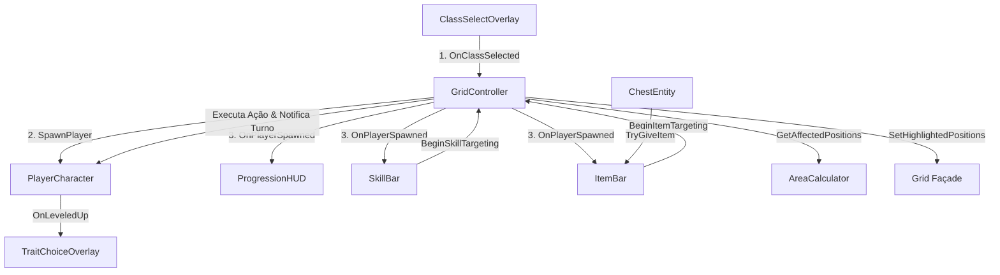

---
tags:
  - plano
  - migracao
  - unity
created: 2026-09-06
updated: 2026-09-06
aliases:
  - Plano de Migração Unity 6 C#
---

# Plano de Migração: Godot 4.7 (GDScript) para Unity 6 (C#)

> Diretivo executável para agentes de IA e desenvolvedores.
> Baseado nas especificações originais em [[GDD]], [[plano_refatoracao]], [[plano_entidades]] e [[plano_progressao]].
> Engine Alvo: **Unity 6 (6000.6.0f1)** com C# e **LitMotion**.

---

## 1. Visão Geral & Objetivos

O objetivo deste documento é orientar a migração completa do jogo **Grid Battle** do ecossistema **Godot 4.7 (GDScript)** para **Unity 6 (C#)**, preservando com exatidão a dinâmica tática por turnos, o timing de animações, o comportamento determinístico da repopulação do tabuleiro e o isolamento de camadas arquiteturais.

### Objetivos Principais
1. **Fidelidade Mecânica:** Preservar a regra central onde o movimento do jogador faz todo o grid deslizar 1 passo na mesma direção do deslocamento e repovoar as bordas vazias.
2. **Padrão Assíncrono com LitMotion:** Substituir os tweens do Godot por **LitMotion**, aproveitando seu pipeline zero-alocação e interoperabilidade com `async Awaitable` / `Task`.
3. **Dados Desacoplados via ScriptableObjects:** Converter as definições de classes, traits, itens, habilidades e tabelas de spawn de `.tres` para `ScriptableObject`s nativos do Unity.
4. **Organização Modular:** Estruturar o projeto sob `Assets/Application/` com namespaces explícitos (`Application.<Module>.Scripts`).

---

## 2. Diagnóstico Atual do Projeto (Status de Implementação)

### 2.1 Matriz de Componentes e Status

| Módulo | Componente / Script | Status | Descrição e Diagnóstico |
|---|---|---|---|
| **Grid** | `CellVisual.cs` | **Concluído** | Controla sprites e tweens LitMotion (flip, shake, punch). |
| **Grid** | `Cell.cs` | **Concluído** | Container de célula, despacha eventos de toque e animações locais. |
| **Grid** | `Grid.cs` | **Concluído** | Fachada única de topologia, cascatas, shifts e preenchimento de bordas. |
| **Grid** | `GridController.cs` | **Concluído** | Orquestra movimentação, combate, turnos, modo de mira (targeting), inicialização com ClassSelectOverlay, hook de level-up e fim de jogo. |
| **Character** | `Health.cs` | **Concluído** | Vida, dano, cura, escudo e eventos C#. |
| **Character** | `Character.cs` | **Concluído** | Base para personagens com animação de dano e instanciação de `DamageText`. |
| **Character** | `PlayerCharacter.cs` | **Concluído** | Atributos do jogador, `Experience`, `Stats`, `TraitSheet`, `SkillComponent`. |
| **Character** | `EnemyCharacter.cs` | **Concluído** | Inimigo básico com XP drop e ataque corpo a corpo. |
| **Character** | `ArcherCharacter.cs` | **Concluído** | Inimigo à distância com ataque em linha/alcance. |
| **Character** | `EliteCharacter.cs` | **Concluído** | Inimigo elite com aura e contra-ataques aprimorados. |
| **Character** | `MimicCharacter.cs` | **Concluído** | Disfarce de baú revelado ao sofrer dano/interação. |
| **Character** | `DamageText.cs` | **Concluído** | Texto flutuante animado via LitMotion. |
| **Entity** | `GridEntity.cs` | **Concluído** | Classe base polimórfica para entidades do tabuleiro. |
| **Entity** | `WallEntity.cs` | **Concluído** | Parede destrutível com vida. |
| **Entity** | `ChestEntity.cs` | **Concluído** | Baú de itens com abertura por toque e drop. |
| **Entity** | `TrapEntity.cs` | **Concluído** | Armadilha de espinhos ativada por pisada. |
| **Entity** | `DirectionalTrapEntity.cs` | **Concluído** | Armadilha rotativa com seta indicativa. |
| **Progression** | `Experience.cs` | **Concluído** | Cálculo de XP acumulado e evento `OnLeveledUp`. |
| **Progression** | `Stats.cs` | **Concluído** | Cálculo determinístico de atributos, modificadores e rolagem de dano. |
| **Progression** | `TraitSheet.cs` | **Concluído** | Gerenciamento de traits adquiridos e `GetEligibleTraits(classDef)`. |
| **Progression** | `ClassDefinition.cs` | **Concluído** | ScriptableObject com atributos iniciais, traits e habilidades de classe. |
| **Progression** | `TraitDefinition.cs` | **Concluído** | ScriptableObject com modificadores de atributos e efeitos passivos. |
| **Progression** | `SpawnEntry.cs` | **Concluído** | ScriptableObject para tabela de spawn por nível de perigo. |
| **Progression** | `SkillDefinition.cs` | **Concluído** | ScriptableObject com cooldown, alcance, área e lógica de `Cast()`. |
| **Progression** | `SkillComponent.cs` | **Concluído** | Container de skills ativas e controle de cooldowns por ação. |
| **Item** | `ItemBase.cs` | **Concluído** | ScriptableObject base para consumíveis e ativos. |
| **Item** | `ItemDropRoller.cs` | **Concluído** | Sorteio ponderado de itens. |
| **Item** | `AreaCalculator.cs` | **Concluído** | Cálculo de posições afetadas para 6 formas geométricas. |
| **Item** | `DamageAreaEffectItem.cs` | **Concluído** | Item de dano em área usando `AreaCalculator`. |
| **Item** | `HealthRegenItem.cs` | **Concluído** | Item de recuperação de vida. |
| **UI** | `ProgressionHUD.cs` | **Concluído** | Sincronização em tempo real de Vida, Escudo, XP e Nível vinculada ao `PlayerCharacter`. |
| **UI** | `ItemBar.cs` / `ItemSlot.cs` | **Concluído** | Componentes de UI de itens integrados ao modo de mira do `GridController`. |
| **UI** | `SkillBar.cs` / `SkillSlot.cs` | **Concluído** | Componentes de exibição dinâmica e clique das habilidades ativas do jogador com cooldown overlay. |
| **UI** | `TraitChoiceOverlay.cs` | **Concluído** | Overlay de escolha de talentos disparado automaticamente pelo `GridController` no level up. |
| **UI** | `ClassSelectOverlay.cs` | **Concluído** | Seleção inicial de classes orquestrada pelo `GridController` antes do início dos turnos. |
| **UI** | `GameOverDialog.cs` | **Concluído** | Diálogo de derrota disparado via `OnPlayerDied` no `GridController`. |

---

## 3. Lacunas Arquiteturais & Solução Projetada

### 3.1 Orquestração do Início de Jogo (`GridController`)
- **Problema:** O `GridController` inicializava o jogador imediatamente no `Start()` sem consultar o `ClassSelectOverlay`.
- **Solução:** No `Start()`, se `_classSelectOverlay != null`, exibir a seleção de classes. Ao confirmar a escolha, instanciar o `PlayerCharacter` com o `ClassDefinition` selecionado, popular o grid e disparar `OnPlayerSpawned`.

### 3.2 Modo de Mira Unificado (Targeting System)
- **Problema:** Nem skills nem itens possuíam forma de selecionar alvos no tabuleiro com feedback visual.
- **Solução:** `GridController` gerencia o estado de mira (`BeginSkillTargeting`, `BeginItemTargeting`, `CancelTargeting`). As posições válidas calculadas por `AreaCalculator` são enviadas para `Grid.SetHighlightedPositions(...)`. O clique na célula executa o efeito (`SkillDefinition.Cast` ou `ItemBase.Apply`), avança o turno e cancela a mira.

### 3.3 Barra de Habilidades (`SkillBar` e `SkillSlot`)
- **Problema:** Não existia UI para visualização das skills do jogador e seus respectivos cooldowns.
- **Solução:** Criar `SkillSlot.cs` (ícone, cooldown overlay, texto de turnos restantes) e `SkillBar.cs` (gerencia a lista de slots, escuta `OnSkillsChanged` e `OnCooldownsChanged` do `SkillComponent` e aciona a mira no `GridController`).

### 3.4 Hook de Level Up e Trait Choice
- **Problema:** `Experience.OnLeveledUp` não acionava a UI de talentos.
- **Solução:** `GridController` intercepta `player.Experience.OnLeveledUp`, trava a entrada (`_inputLocked = true`) e chama `_traitChoiceOverlay.PresentChoices(player.TraitSheet.GetEligibleTraits(player.ClassDef), trait => { player.TraitSheet.AddTrait(trait); _inputLocked = false; })`.

---

## 4. Contratos de APIs e Dependências

---

## 5. Guia para Continuidade do Desenvolvimento

Para agentes de IA subsequentes ou desenvolvedores:
1. **Regra de Ouro da Fachada:** Qualquer interação com o tabuleiro deve passar exclusivamente pelos métodos públicos de `Grid.cs`.
2. **Modo de Mira:** O clique no tabuleiro enquanto `_isTargeting == true` deve consumir o clique prioritariamente para a habilidade/item antes de qualquer lógica de movimento.
3. **Gerenciamento de Cooldowns:** As skills devem ter seus cooldowns decrementados em `SkillComponent.TickCooldowns()` a cada ação válida do jogador (movimento, ataque básico ou uso de skill/item).
4. **Convenções de Código:** Seguir rigorosamente namespaces `Application.<Módulo>.Scripts`, propriedades `PascalCase`, variáveis privadas `_camelCase` e tweens assíncronos LitMotion.

---

## 6. Estado da Cena (Sessão 2026-09-07)
A cena `Assets/Scenes/Main.unity` está montada e funcional no Editor (via unity-cli/Pipeline, não gerada em runtime):
- **HUDCanvas** (1080x1920, Scale With Screen Size): `ProgressionHUD` (Vida/Escudo/XP/Nível), `SkillBar` (3 slots com cooldown), `ItemBar` (3 slots), `ClassSelectOverlay` (Warrior/Rogue/Mage), `TraitChoiceOverlay` (3 cards), `GameOverDialog`.
- **EventSystem** com `InputSystemUIInputModule` (projeto usa Input System package — StandaloneInputModule quebra com exceções).
- **GridController** com todas as referências de UI conectadas + tabela de spawn com Slime (w5) e Chest (w2).
- **Dados:** skills `SkillCleave`/`SkillLance` como startingSkills das classes; itens `ItemPotion`/`ItemBomb` no pool do `Chest.prefab`; `SpawnChest.asset` na tabela.
- **Correção de código:** `ChestEntity` entregava o item rolado e o descartava; agora chama `GridController.TryGiveItem(item)` → `ItemBar.AddItem`.
- **Validação:** 17/17 testes EditMode passando; Play mode verificado (seleção de classe → spawn → HUD → skill carregada) sem exceções.
- **Setup idempotente:** `Assets/Application/UI/Editor/UiSceneSetup.cs` (`unity command run_script -- <path> Run`).
- **Próximos passos sugeridos:** ícones definitivos para skills/itens/classes (hoje placeholders de cor), sprite do baú, balanceamento da tabela de spawn e polimento visual dos overlays.