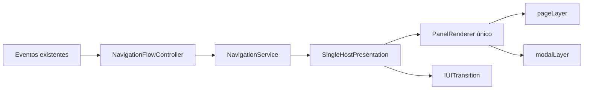
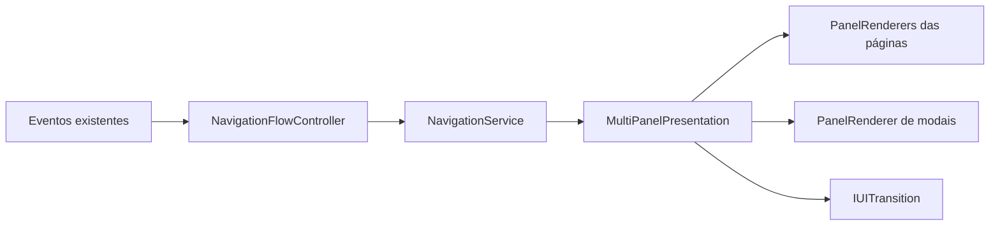
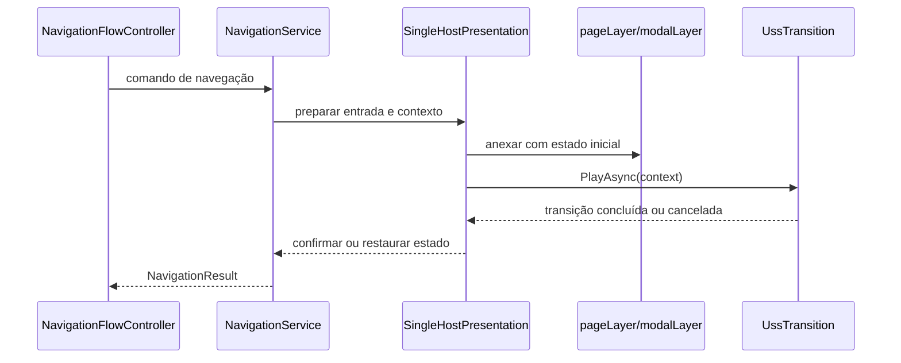

---
tags:
  - plano
  - ui-toolkit
  - navegacao
created: 2026-09-13
updated: 2026-09-13
aliases:
  - Plano de Navegação Stack com UI Toolkit
---

# Plano de Navegação Stack com UI Toolkit

> Documento de planejamento. As alterações descritas em C#, UXML, USS e na cena são trabalho futuro; esta entrega não implementa os caminhos propostos.

## 1. Escopo e decisão arquitetural

O objetivo é planejar uma navegação baseada em pilhas para páginas e modais usando Unity UI Toolkit, com transições animadas e possibilidade de substituir o executor visual no futuro.

Serão mantidos dois caminhos alternativos, com requisitos equivalentes:

- **A — Host único:** um `PanelRenderer` contém as camadas de páginas e modais.
- **B — Painéis existentes:** cada tela continua em seu `PanelRenderer`, coordenada por um navegador central, com um `PanelRenderer` adicional para modais.

Os caminhos não devem ser implementados simultaneamente. A escolha deve ser feita antes da etapa de apresentação; o núcleo de navegação e seus testes podem ser desenvolvidos de forma independente da apresentação.

### 1.1 Fora do escopo inicial

- Persistência entre cenas ou sessões.
- Addressables e navegação por URLs.
- Redesign visual das telas e regras de gameplay.
- Múltiplas instâncias simultâneas do mesmo tipo de página ou modal.
- Obrigatoriedade de LitMotion ou implementação imediata de um adaptador de animação.

## 2. Base atual investigada

### 2.1 Projeto e dependências

- `ProjectSettings/ProjectVersion.txt:1` define Unity `6000.6.0f1`.
- `Packages/manifest.json:3` já inclui LitMotion e `Packages/manifest.json:20` inclui Unity Test Framework. O primeiro desenho não precisa adicionar dependências.
- `Assets/UI Toolkit/PanelSettings.asset:27` usa resolução de referência `216×384`; `m_SortingOrder` do asset é `0` na linha 30.

### 2.2 Base `Screen`

`Assets/Application/Scripts/UI/Screen.cs:6–26` define um `MonoBehaviour` abstrato que:

1. exige um `PanelRenderer` próprio com `[RequireComponent]`;
2. captura esse renderizador em `Awake`;
3. registra `ReloadUICallback` em `OnEnable`;
4. remove o callback em `OnDisable`;
5. entrega ao controlador o `PanelRenderer`, a raiz visual e a versão de reconstrução.

Esse vínculo direto é a principal adaptação necessária no caminho A. No caminho B, ele pode ser preservado e ampliado com operações explícitas de apresentação.

### 2.3 Telas atuais

- `Assets/Application/Scripts/UI/StartScreen.cs:11–24` consulta `tap-to-play-label` e `container` na raiz recebida. A animação local do texto alterna `opacity-0` após `TransitionEndEvent` e após um agendamento de 100 ms. O `PointerUpEvent` do contêiner alterna `display-none` e `translate-right` e publica `StartScreenTapEvent`.
- `Assets/Application/Scripts/UI/MainMenuScreen.cs:10–20` assina e remove a assinatura de `StartScreenTapEvent`. Em `Assets/Application/Scripts/UI/MainMenuScreen.cs:22–30`, o clique no contêiner alterna sua visibilidade e publica `CharacterChoosenEvent`; em `:33–37`, a reação ao evento também alterna as classes do contêiner.
- `Assets/Application/Scripts/UI/GameScreen.cs:13–23` assina e remove a assinatura de `CharacterChoosenEvent`. O callback de reconstrução guarda a raiz em `:32–35`; o tratamento do evento consulta `container` e alterna suas classes em `:25–30`.
- `Assets/Application/UI/StartScreen.uxml:3–6` contém um único `container` com logo e texto de toque.
- `Assets/Application/UI/MainMenuScreen.uxml:3–14` começa com `display-none translate-right` e contém a seleção horizontal de personagens.
- `Assets/Application/UI/GameScreen.uxml:3–17` também começa oculto e deslocado, contendo as áreas de experiência, jogo e ações.

O fluxo atual é orientado por eventos e toggles locais, não possui histórico de páginas e deixa a decisão de esconder ou revelar outras telas distribuída entre os controladores.

### 2.4 Estilos, cena e eventos

- `Assets/Application/UI/USS/Base.uss:13–20` define a classe `.container`, inclusive `transition-duration: 0.25s` e largura fixa de `216px`.
- `Assets/Application/UI/USS/Base.uss:32–46` define as classes `.opacity-0`, `.opacity-1`, `.display-none` e `.translate-right`; esta última usa `translate: 216px 0`.
- `Assets/Scenes/SampleScene.unity` contém os objetos `StartScreen`, `MainMenuScreen` e `GameScreen`, cada um com seu `PanelRenderer`. Os renderizadores aparecem com `m_SortingOrder: 0` para `StartScreen` (`:557–560`), `1` para `MainMenuScreen` (`:752–755`) e `2` para `GameScreen` (`:454–457`).
- `Assets/Application/Scripts/EventBus.cs:34–90` oferece `Subscribe`, `Unsubscribe` e `Raise` genéricos. Os callbacks são armazenados por tipo e invocados de forma síncrona; não há fila, resultado assíncrono ou encaminhamento automático à thread principal.
- `StartScreenTapEvent` preserva `TapPosition` em `Assets/Application/Scripts/UI/Events/StartScreenTapEvent.cs:5–12`.
- `CharacterChoosenEvent` não possui payload em `Assets/Application/Scripts/UI/Events/CharacterChoosenEvent.cs:3–6`.

As orientações de UI Toolkit para o trabalho futuro são: manter transições na classe USS base, preferir classes em vez de estilos inline, usar a ordem da hierarquia para sobreposição, limitar consultas à raiz da view e não introduzir `z-index` ou propriedades USS não suportadas.

## 3. Modelo comum de navegação

Um `NavigationService` controla duas pilhas LIFO independentes:

- **Pilha de páginas:** conserva as páginas anteriores e seu estado enquanto elas permanecem no histórico.
- **Pilha de modais:** sobrepõe a página atual sem alterar o histórico de páginas; somente o modal superior recebe entrada.

### 3.1 Operações

| Operação | Regra | Resultado esperado |
|---|---|---|
| `PushAsync<TPage>()` | Resolve `TPage` no catálogo, cria ou reutiliza sua entrada e a adiciona ao topo, conservando a anterior. | Página de tipo `TPage` no topo após a entrada terminar. |
| `PopAsync<TPage>()` | Remove a página superior somente se ela for do tipo esperado `TPage` e revela a anterior. | `AtRoot` quando só existe a raiz; `TypeMismatch` sem alterar a pilha quando o topo não for `TPage`. |
| `ReplaceAsync<TPage>()` | Resolve `TPage` no catálogo e substitui apenas a página superior. | Página de tipo `TPage` no topo sem aumentar o histórico. |
| `ShowModalAsync<TModal>()` | Resolve `TModal` no catálogo, cria ou reutiliza sua entrada e a adiciona sobre a página atual. | Modal de tipo `TModal` ativo após sua abertura. |
| `CloseModalAsync<TModal>()` | Fecha o modal superior somente se ele for do tipo esperado `TModal`. | Foco anterior restaurado ou substituído por fallback válido; `TypeMismatch` se outro modal estiver no topo. |
| `BackAsync<TExpectedEntry>()` | Verifica o tipo da entrada superior, fecha primeiro o modal superior e, sem modal, faz o pop da página. | Nunca atravessa um modal nem altera a pilha quando o tipo esperado não corresponde. |

As operações de página ficam bloqueadas enquanto houver modal aberto. Modais podem ser sobrepostos, mas apenas o superior é interativo.

`TPage`, `TModal` e `TExpectedEntry` são tipos registrados no catálogo, e não identificadores de rota ou payloads de eventos. O tipo funciona como chave da definição de apresentação e da entrada ativa; assim, a criação, a restauração e o ciclo de vida são gerenciados pela definição correspondente. `PopAsync<TPage>()`, `CloseModalAsync<TModal>()` e `BackAsync<TExpectedEntry>()` usam o parâmetro genérico como pré-condição explícita, evitando remover ou fechar uma entrada de tipo diferente.

### 3.2 Regras de validação e concorrência

- Uma operação de navegação por vez. Uma nova solicitação durante uma transição retorna `Busy`; ela não é enfileirada.
- Tipos não registrados, registrados com a categoria errada, incompatíveis com a operação ou já ativos são rejeitados sem mutar as pilhas.
- No escopo inicial, cada tipo registrado possui uma única instância ativa.
- O catálogo fornece referências explícitas por tipo para UXML, controlador, fábrica/apresentação e preset de transição; não depende de buscas globais na cena. Um identificador textual pode existir apenas como metadado de diagnóstico.
- O estado de pilha e o estado visual só são confirmados depois que a apresentação concluir.
- Falhas ou cancelamentos anteriores à confirmação restauram o último estado consistente. O bloqueio é liberado em `finally`.
- Ao destruir o host, as operações pendentes são canceladas e a entrada é liberada.
- Após reconstrução da árvore visual, referências antigas são invalidadas e as entradas ainda válidas são vinculadas novamente.

### 3.3 Contratos indicativos

Os contratos abaixo usam `Awaitable` nativo do Unity 6 e serão refinados durante a implementação:

```csharp
public interface INavigationService
{
    bool IsBusy { get; }
    Awaitable<NavigationResult> PushAsync<TPage>(CancellationToken ct = default) where TPage : Screen;
    Awaitable<NavigationResult> PopAsync<TPage>(CancellationToken ct = default) where TPage : Screen;
    Awaitable<NavigationResult> ReplaceAsync<TPage>(CancellationToken ct = default) where TPage : Screen;
    Awaitable<NavigationResult> ShowModalAsync<TModal>(CancellationToken ct = default) where TModal : Screen;
    Awaitable<NavigationResult> CloseModalAsync<TModal>(CancellationToken ct = default) where TModal : Screen;
    Awaitable<NavigationResult> BackAsync<TExpectedEntry>(CancellationToken ct = default) where TExpectedEntry : Screen;
}

public interface INavigationCatalog
{
    NavigationDefinition<TPage> GetPage<TPage>() where TPage : Screen;
    NavigationDefinition<TModal> GetModal<TModal>() where TModal : Screen;
}

public interface IUITransition
{
    Awaitable PlayAsync(TransitionContext context, CancellationToken ct);
}
```

O modelo de dados deverá conter:

- `NavigationEntry`: identidade, `Type` concreto registrado, categoria (página ou modal), apresentação e foco anterior;
- `NavigationDefinition<T>`: associação tipada entre `T`, categoria, UXML, controlador/fábrica, apresentação e preset de transição;
- `NavigationResult`: conclusão, ocupação, raiz, bloqueio por modal, tipo não registrado/incompatível ou tipo já ativo;
- `TransitionContext`: operação, direção, elementos envolvidos e preset selecionado;
- `INavigationPresentation`: aquisição da view, montagem, visibilidade, ordenação, bloqueio de entrada, foco e liberação.

O catálogo deve rejeitar registro duplicado do mesmo `T`, registro de uma página como modal (ou vice-versa) e definições sem controlador ou UXML compatível. A resolução genérica ocorre antes de qualquer mutação visual; somente a entrada correspondente ao tipo resolvido pode ser criada, reutilizada, coberta ou removida.

### 3.4 Ciclo de vida da apresentação

Cada entrada deve seguir estados explícitos, independentemente do caminho escolhido:

1. vincular a raiz visual e callbacks;
2. preparar a apresentação;
3. entrar e tornar-se a entrada superior;
4. ficar coberta sem ser destruída;
5. voltar ao topo, quando revelada;
6. sair antes de ser ocultada ou desvinculada;
7. remover callbacks, inscrições e agendamentos.

Cobrir uma página não equivale a destruí-la. Animações locais, como o texto de `StartScreen`, devem ser suspensas enquanto sua página estiver oculta e não podem ser confundidas com a transição da navegação.

## 4. Integração prevista com os eventos atuais

Um `NavigationFlowController` será responsável por traduzir as intenções existentes para o serviço, sem transferir a ele a decisão de composição visual:

- `StartScreenTapEvent` pode resultar em `ReplaceAsync<MainMenuScreen>()`.
- `CharacterChoosenEvent` pode resultar em `PushAsync<GameScreen>()`.

Os eventos e seus payloads atuais serão preservados. As telas deixarão de esconder outras páginas ou reagir a eventos para navegar; essa responsabilidade passará ao controlador de fluxo. A seleção deve ser ligada aos botões apropriados, em vez de depender de qualquer clique que alcance o contêiner do menu.

O `EventBus` permanece sem alterações e funciona como ponte para intenções existentes. Notificações opcionais de navegação só devem ser publicadas após a confirmação da operação; uma falha de observador não desfaz uma navegação concluída nem mantém o serviço ocupado.

Chamadas de navegação e manipulação visual devem ocorrer na thread principal. O encaminhamento para essa thread, caso uma intenção venha de outro contexto, pertence ao adaptador do fluxo e não ao `EventBus` atual.

## 5. Alternativas de apresentação

As duas alternativas consomem o mesmo `INavigationService`, catálogo tipado por `T` e `IUITransition`. A diferença está em onde as raízes visuais são montadas e como a apresentação controla a ordem, o foco e o bloqueio de entrada.

### 5.1 A — Host único



Estrutura visual proposta:

```text
[VisualElement] name="navigationRoot" class="navigation-root"
├── [VisualElement] name="pageLayer" class="navigation-pages"
│   └── [VisualElement] class="page-entry"
│       └── [VisualElement] class="page-content"
├── [VisualElement] name="modalLayer" class="navigation-modals"
│   └── [VisualElement] class="modal-entry"
│       ├── [VisualElement] class="modal-backdrop"
│       └── [VisualElement] class="modal-content"
└── [VisualElement] name="transitionBlocker" class="navigation-blocker"
```

#### Composição

- Criar `Assets/Application/UI/NavigationHost.uxml` como a única raiz de composição e manter o `PanelRenderer` com `Assets/UI Toolkit/PanelSettings.asset`. Não migrar automaticamente para `UIDocument`.
- Criar `NavigationHost.cs` para adquirir a raiz do renderizador, centralizar `RegisterUIReloadCallback` e entregar novas raízes à apresentação quando a árvore for reconstruída.
- Criar `SingleHostPresentation.cs` para manter referências aos contêineres `pageLayer`, `modalLayer` e `transitionBlocker`, além das entradas ativas e de seus controladores.
- Para cada `TPage` ou `TModal`, instanciar o `VisualTreeAsset` resolvido pelo catálogo dentro de um `page-entry` ou `modal-content` próprio. Consultas como `Q("container")` devem partir da raiz da entrada, nunca do `navigationRoot` inteiro.
- Manter páginas cobertas no `pageLayer`, preservando seu estado, e usar a ordem dos filhos para colocar a entrada superior por último. Modais ficam depois das páginas na hierarquia; o bloqueador fica acima durante a transição.
- Aplicar a mesma regra de ordem à pilha de modais: backdrop e conteúdo pertencem à entrada do modal, e somente a entrada superior recebe foco e entrada.

#### Adaptação dos controladores

`Screen` deixará de exigir um `PanelRenderer` próprio neste caminho. O host fornecerá ao controlador a raiz visual e um ciclo explícito de vinculação, equivalente ao atual `ReloadUICallback`, para que `StartScreen`, `MainMenuScreen` e `GameScreen` continuem como `MonoBehaviour`s sem possuir a composição global.

As responsabilidades serão separadas assim:

- o `NavigationService` altera as pilhas e confirma estados;
- `SingleHostPresentation` monta, ordena, bloqueia e libera entradas;
- cada `Screen` consulta apenas sua raiz e registra callbacks locais;
- `NavigationFlowController` converte eventos em comandos de navegação;
- o host cancela callbacks e agendamentos antes de vincular uma raiz reconstruída.

O comportamento visual existente de `GameScreen` transparente e a resolução `216×384` do `PanelSettings` devem ser preservados. Seletores genéricos como `#container` e `ScrollView` precisam ser escopados à classe da entrada para que as árvores hospedadas não interfiram umas nas outras.

#### Reutilização e riscos

- Os três UXML existentes podem ser reutilizados como conteúdo de entrada, mas seus estados iniciais de `display-none` e `translate-right` deixarão de decidir a navegação. O host aplicará classes de estado conforme o `TPage` ou `TModal` resolvido.
- A hierarquia única facilita uma transição simultânea entre página antiga e nova, além do backdrop dos modais, sem depender de valores de `sortingOrder`.
- O custo inicial é maior: `Screen`, `SampleScene.unity` e a forma de registrar os controladores precisam ser adaptados.
- Uma única reconstrução pode invalidar todas as referências visuais hospedadas; o callback do host deve reatar cada entrada válida sem duplicar inscrições.
- Árvores de páginas conservadas no histórico aumentam o custo de layout e memória; a política de retenção deve ser medida, não presumida como ganho de desempenho.

### 5.2 B — Painéis existentes



#### Composição

- Manter em `Assets/Scenes/SampleScene.unity` os objetos `StartScreen`, `MainMenuScreen` e `GameScreen`, seus `PanelRenderer`s e referências aos UXML atuais.
- Criar `MultiPanelPresentation.cs` para registrar cada `TPage` e `TModal` com seu renderizador, controlar a disponibilidade da raiz e coordenar as apresentações do serviço.
- Preservar a exigência atual de `Screen` em relação a `PanelRenderer`, acrescentando métodos idempotentes de vinculação, preparação, cobertura, retorno ao topo e saída.
- Criar `Assets/Application/UI/ModalHost.uxml` e `ModalHost.cs` em um renderizador dedicado. O host empilha `modal-entry`, backdrop e conteúdo sem alterar a pilha das páginas.
- Usar os valores `0`, `1` e `2` encontrados na cena apenas como ponto de partida. A apresentação deve controlar a ordenação enquanto uma entrada entra ou sai, sem depender permanentemente desses números.
- Ao apresentar um modal, coordenar foco e bloqueio nas raízes de todos os renderizadores. A sobreposição visual de um painel não impede, sozinha, que controles de outro painel recebam entrada.

#### Reutilização e riscos

- Os UXML e USS atuais permanecem associados aos tipos de tela registrados, reduzindo a migração imediata e preservando o isolamento natural entre árvores distintas.
- A transição entre dois `PanelRenderer`s exige sincronizar a saída de uma raiz, a entrada da outra, a ordenação e a disponibilidade dos callbacks.
- Reconstruções são independentes: cada tela deve informar quando sua raiz está pronta, e o navegador precisa lidar com estados parciais sem apresentar uma raiz antiga.
- Um `ModalHost` vazio não pode interceptar ponteiro, teclado ou foco; o bloqueio deve ser ativado somente enquanto existir modal ou transição que o exija.
- A coordenação entre painéis é mais complexa para foco, acessibilidade e entrada, mesmo que a alteração inicial na cena seja menor.

### 5.3 Comparação e critério de escolha

| Critério | A — Host único | B — Painéis existentes |
|---|---|---|
| Migração inicial | Maior: adaptar `Screen` e a composição da cena. | Menor: preservar renderizadores e referências atuais. |
| Camadas e modais | Uma hierarquia concentra ordem, backdrop e bloqueio. | Exige ordenar renderizadores e uma hierarquia interna de modais. |
| Foco e entrada | Controle centralizado no host. | Coordenação explícita entre todas as raízes. |
| Reconstrução | Um ponto de reata pode afetar todas as views. | Reconstruções independentes geram mais estados de prontidão. |
| Estilos | Exige escopo explícito entre conteúdos hospedados. | Mantém a separação das árvores atuais. |
| Novas páginas | Adiciona catálogo e UXML, sem novo renderizador. | Adiciona registro de renderizador ou futura fábrica de apresentações. |
| Retenção | Menos componentes de apresentação, mas medir árvores retidas e layout. | Mais coordenação e renderizadores; não presumir um painel interno por renderizador. |
| Indicação | Evolução de um sistema centralizado de navegação. | Migração incremental com menor alteração imediata. |

O plano recomenda A para a evolução do sistema, porque uma única hierarquia torna explícitas as camadas necessárias às animações, ao foco e aos modais. B continua sendo um caminho válido quando o risco de alterar `Screen` e a cena for mais importante que a simplificação posterior; os dois não devem ser implementados juntos.

### 5.4 Arquivos futuros por alternativa

| Área | Host único | Painéis existentes |
|---|---|---|
| Apresentação | `NavigationHost.cs`, `SingleHostPresentation.cs`, `Assets/Application/UI/NavigationHost.uxml` | `MultiPanelPresentation.cs`, `ModalHost.cs`, `Assets/Application/UI/ModalHost.uxml` |
| Contratos e núcleo | `Assets/Application/Scripts/UI/Navigation/` para contratos, pilhas, serviço, catálogo e fluxo | O mesmo núcleo compartilhado |
| Transições | `IUITransition.cs`, `UssTransition.cs`, `Assets/Application/UI/USS/Navigation.uss` | Os mesmos componentes aplicados às raízes registradas |
| Adaptação | `Screen.cs` recebe raízes fornecidas pelo host; cena passa a ter um renderizador de navegação | `Screen.cs` recebe ciclo idempotente; cena registra renderizadores e modal host |
| Migração | `StartScreen.cs`, `MainMenuScreen.cs`, `GameScreen.cs` deixam de controlar visibilidade global | As telas deixam de controlar visibilidade global, preservando seus renderizadores |

## 6. Modais, entrada e foco no host único

O `modalLayer` permanece acima do `pageLayer` na hierarquia. Cada modal é uma entrada composta por backdrop e conteúdo, para que a página continue visível sob a sobreposição e não precise ser reconstruída ou removida.

- O backdrop ocupa toda a área de `navigationRoot` e recebe a entrada do modal superior resolvido como `TModal`.
- Fechamento por clique externo é configurável e fica desabilitado por padrão.
- `BackAsync<TExpectedEntry>` fecha o modal superior antes de considerar qualquer operação na pilha de páginas. Se o modal não permitir retorno, a página sob ele não é alcançada; o tipo esperado deve corresponder ao topo antes da operação.
- Enquanto um modal está aberto, a apresentação suspende ponteiro, submit e navegação por teclado das páginas cobertas e confina o foco ao modal superior.
- `picking-mode="Ignore"` isoladamente não é suficiente, porque não desabilita automaticamente os descendentes nem resolve foco; o host deve aplicar bloqueio explícito e controlar o foco.
- Antes da abertura, o host guarda o elemento focado. Depois do fechamento, restaura-o se ainda estiver anexado e válido; caso contrário, foca um controle válido da view revelada.
- O estado original de `enabled` dos controles deve ser guardado antes do bloqueio e restaurado sem transformar um controle originalmente desabilitado em habilitado.
- `transitionBlocker` fica acima de todas as camadas apenas durante uma operação. Ele impede novos comandos enquanto a animação é preparada ou executada e não substitui o bloqueio permanente do modal.

## 7. Animações com um host único

### 7.1 Princípio

No host único, a animação não troca `PanelRenderer`s. A apresentação mantém as entradas dentro das camadas e anima apenas as classes USS da entrada ou de seus elementos internos. A pilha é alterada logicamente apenas depois que a animação terminou com sucesso.



O contrato `IUITransition` permite trocar `UssTransition` por outro executor no futuro, mas o caminho inicial usa somente classes USS e eventos do UI Toolkit.

### 7.2 Estados USS previstos

Os nomes abaixo são estados conceituais; os valores finais pertencem a `Assets/Application/UI/USS/Navigation.uss` e não serão aplicados como estilo inline:

- `.navigation-entry`: classe base com geometria da entrada, `transition-duration` e easing;
- `.navigation-entry--prepared`: entrada montada, ainda fora do estado final, sem `display: none`;
- `.navigation-entry--visible`: opacidade e deslocamento finais;
- `.navigation-entry--enter-forward` e `.navigation-entry--enter-backward`: estados iniciais conforme a direção;
- `.navigation-entry--exit-forward` e `.navigation-entry--exit-backward`: estados de saída conforme a operação;
- `.navigation-entry--covered`: entrada mantida no histórico, sem receber interação;
- `.navigation-blocker--active`: bloqueador visível durante a operação.

As transições devem ser declaradas na classe base da entrada, não apenas no estado de destino. O preset modifica `opacity` e `translate` por classes; não introduz `z-index`, estilos inline ou `transition-property` explícito. O deslocamento deve usar a geometria disponível da entrada ou valores relativos suportados pelo UI Toolkit, e não repetir o valor fixo `216px` usado hoje em `Base.uss`.

O `display: none` não participa da interpolação. Uma entrada permanece anexada e visível até o fim da saída; só depois a apresentação pode removê-la ou aplicar a classe de ocultação definitiva.

### 7.3 Sequência segura de uma operação

Para qualquer `TPage` ou `TModal`, `SingleHostPresentation` seguirá esta sequência:

1. confirmar que o comando está na thread principal, que não existe outra operação e que a regra da pilha permite a mudança;
2. capturar o estado visual confirmado, a entrada focada e as referências que poderão precisar ser restauradas;
3. adquirir ou reutilizar a view pelo catálogo e criar seu wrapper isolado (`page-entry` ou `modal-entry`);
4. vincular o controlador à raiz do wrapper, registrar callbacks e aplicar a classe inicial antes de iniciar qualquer animação;
5. anexar o wrapper à camada correta na ordem que representa o topo da pilha;
6. esperar a montagem, a associação ao painel e a resolução inicial de estilos e layout, usando o agendamento ou evento de geometria adequado;
7. ativar `transitionBlocker`, mudar as classes para o estado de entrada/saída e iniciar `IUITransition`;
8. aguardar somente as propriedades e os elementos pertencentes à operação;
9. normalizar as classes, remover o bloqueador, ajustar foco e entrada e confirmar as pilhas;
10. em falha ou cancelamento antes da confirmação, remover a entrada provisória ou restaurar a ordem e as classes anteriores, limpar callbacks e liberar o bloqueio em `finally`.

O estado `Preparing` não deve ser publicado como navegação concluída. Isso evita que observadores do `EventBus` reajam antes da transição e permite que uma falha volte ao último estado consistente.

### 7.4 Transição de página por operação

#### `PushAsync<TPage>`

1. A página atual continua no `pageLayer` como entrada coberta e conserva seu estado.
2. A nova página é instanciada em um wrapper e anexada como último filho, ficando acima da anterior pela ordem da hierarquia.
3. O wrapper recebe o estado inicial de `enter-forward` e, após o layout estar pronto, passa para `visible`; o `translate` e a opacidade são interpolados pelo USS.
4. A entrada anterior perde interação e recebe o estado `covered`, mas não é destruída.
5. Ao terminar, a nova entrada torna-se o topo confirmado e o foco é transferido para ela.

#### `PopAsync<TPage>`

1. Se a página atual for a raiz, não há animação de navegação e o serviço retorna `AtRoot`.
2. A página anterior já retida é reativada como candidata ao topo; a apresentação ajusta a ordem dos filhos para que a relação visual seja determinística.
3. A página atual recebe `exit-backward` e a página revelada recebe `enter-backward`, permitindo que o retorno use a direção inversa da entrada.
4. Somente após a saída concluir a página removida é desvinculada e seus callbacks são limpos; a página revelada é confirmada no topo.
5. O foco anterior da entrada revelada é restaurado quando ainda for válido, com fallback para a própria página.

#### `ReplaceAsync<TPage>`

1. A nova página é preparada ao lado da atual, sem adicionar uma posição ao histórico.
2. A apresentação executa a saída da atual e a entrada da nova em uma transição coordenada, escolhendo se o preset será simultâneo ou sequencial.
3. A antiga página só é desvinculada depois do fim visual; a nova só substitui a referência confirmada depois que ambas as fases concluírem.
4. Se houver falha, a página anterior e sua ordem visual são restauradas, sem aumentar nem reduzir a pilha.

### 7.5 Transição de modal

Para `ShowModalAsync<TModal>`, o `pageLayer` não muda. A apresentação resolve `TModal`, anexa um `modal-entry` ao `modalLayer`, anima backdrop e conteúdo com o mesmo contexto e mantém as páginas bloqueadas. Para `CloseModalAsync<TModal>`, o modal superior executa a saída somente depois da validação do tipo, permanece anexado até concluí-la, é então removido e o foco retorna ao modal anterior ou à página revelada.

Modais sobrepostos repetem esse fluxo dentro de `modalLayer`; somente o último filho é interativo. O host não deve fechar um modal inferior diretamente nem alterar a pilha de páginas para resolver o retorno.

### 7.6 Implementação inicial e presets

`UssTransition` será a implementação inicial de `IUITransition`:

- `None`: aplica estados finais sem aguardar uma animação, mantendo exatamente as mesmas regras de bloqueio, confirmação e limpeza;
- `Fade`: anima `opacity` da entrada e, para modal, pode animar backdrop e conteúdo com durações próprias;
- `Slide`: anima `translate` com direção forward ou backward, usando a geometria da camada e não a largura fixa atual da tela.

Duração e easing serão escolhidos por classes USS associadas ao tipo registrado e à operação. LitMotion já está disponível no projeto, mas permanece opcional e não será introduzido como requisito desta primeira implementação.

### 7.7 Conclusão, eventos e cancelamento

- A conclusão deve observar o elemento raiz da transição e as propriedades esperadas, verificando que o alvo do evento é a própria entrada; eventos propagados de descendentes são ignorados.
- Isso é obrigatório para não confundir a transição local de `tap-to-play-label` em `StartScreen.cs:14–16` com a transição da página.
- Duração zero, ausência de alteração visual ou elemento já no estado final concluem sem esperar indefinidamente por `TransitionEndEvent`.
- `TransitionCancelEvent`, reconstrução da árvore visual, desativação do host e destruição do objeto cancelam a operação visual, removem callbacks e agendamentos e restauram o último estado confirmado.
- O executor usa um prazo máximo calculado a partir da duração e do atraso do preset, com margem para montagem e layout. O prazo é uma proteção, não a confirmação de uma propriedade diferente.
- Ao concluir ou cancelar, as classes temporárias são normalizadas, o `transitionBlocker` é liberado e as entradas deixam de reter referências antigas.
- O bloqueio de operação é liberado em `finally`, inclusive quando o controlador, a raiz ou um observador lança uma falha.

### 7.8 Critérios verificáveis

- `Fade`, `Slide` e `None` chegam ao mesmo estado final de pilha e visibilidade.
- Uma página só é removida depois da saída e uma página coberta conserva seu estado enquanto estiver no histórico.
- Um modal cobre a página sem alterá-la; `BackAsync<TExpectedEntry>` fecha o modal superior antes de fazer `PopAsync<TPage>`.
- Um segundo comando durante a preparação ou animação retorna `Busy` e não gera uma segunda entrada.
- Um cancelamento antes da confirmação deixa as pilhas, a ordem dos filhos, o foco e o bloqueio no estado anterior.
- Um `TransitionEndEvent` emitido por um filho não conclui a transição do wrapper.
- Reconstrução ou destruição durante uma transição não deixa callback duplicado, agendamento pendente ou operação ocupada.

## 8. Limite desta etapa

O host único pode realizar animações mantendo todas as entradas na mesma árvore: o serviço prepara uma operação, a apresentação aplica classes USS a wrappers isolados, o executor aguarda a transição própria e só então confirma a pilha. A implementação de `NavigationHost`, `SingleHostPresentation`, `UssTransition`, UXML e USS continua sendo trabalho futuro; os roteiros de migração e a distribuição dos testes serão organizados na etapa seguinte.

## 9. Roteiro de implementação

Os marcos abaixo são executados em ordem. A equipe deve escolher A ou B antes do marco de apresentação; o núcleo comum não implica implementar as duas apresentações.

| Marco | A — Host único | B — Painéis existentes |
|---|---|---|
| Núcleo | Modelo de entradas, duas pilhas, catálogo, contratos, serviço e testes independentes da UI. | O mesmo núcleo compartilhado. |
| Apresentação | Criar host, camadas sobrepostas e adaptação de `Screen` para raízes fornecidas pelo host. | Registrar os renderizadores atuais, disponibilidade de raízes, ordenação e ciclo idempotente. |
| Modais | Montar `modalLayer`, backdrop, foco confinado e retorno modal-first no mesmo painel. | Criar renderizador e `ModalHost` dedicados, bloqueando explicitamente as demais raízes. |
| Animações | Aplicar `UssTransition` aos wrappers de `pageLayer` e `modalLayer`, com cancelamento e recuperação. | Aplicar o mesmo executor às raízes registradas, sincronizando saída, entrada e `sortingOrder`. |
| Fluxo atual | Integrar eventos, migrar a cena para o host e validar retorno entre telas. | Integrar eventos sem consolidar os três renderizadores e validar o mesmo fluxo. |

### 9.1 Núcleo comum

1. Criar os contratos, `NavigationEntry`, `NavigationResult`, `TransitionContext` e o catálogo em `Assets/Application/Scripts/UI/Navigation/`.
2. Implementar `NavigationService` com as regras de página e modal descritas neste documento, sem depender de `VisualElement` concreto.
3. Implementar `NavigationFlowController` como consumidor do `EventBus`, executando comandos na thread principal e publicando notificações apenas depois da confirmação.
4. Cobrir primeiro o núcleo em EditMode com uma apresentação falsa que possa sinalizar sucesso, falha, cancelamento e ocupação.

### 9.2 Migração do fluxo existente

- `StartScreen` continua publicando `StartScreenTapEvent` com `TapPosition`, mas deixa de esconder outras telas. O `NavigationFlowController` traduz a intenção para `ReplaceAsync<MainMenuScreen>()`.
- Os botões de personagem em `MainMenuScreen` passam a ser os emissores da intenção de seleção; o clique não deve ser tratado genericamente no contêiner. O evento `CharacterChoosenEvent` conserva a ausência de payload.
- O controlador traduz `CharacterChoosenEvent` para `PushAsync<GameScreen>()`; as telas deixam de reagir ao evento para trocar suas próprias classes de visibilidade.
- O fluxo demonstrativo deve ser `StartScreen → MainMenuScreen → GameScreen → MainMenuScreen`: a substituição inicial não cria histórico de `StartScreen`, o `PushAsync<GameScreen>()` cria uma entrada e o `PopAsync<GameScreen>()` retorna ao menu conservado.
- As inscrições do controlador de fluxo devem ser removidas no ciclo de vida apropriado. A reconstrução das árvores deve reatar callbacks sem duplicá-los.

### 9.3 Trabalho específico do caminho A

1. Na cena, substituir a composição de três renderizadores por um host de navegação com o `PanelSettings` existente, preservando transparência, resolução e demais configurações visuais necessárias.
2. Adaptar `Screen.cs` para receber uma raiz e uma sessão de vinculação do host, retirando a dependência de um `PanelRenderer` por tela.
3. Registrar `StartScreen`, `MainMenuScreen` e `GameScreen` como tipos de página no catálogo e reutilizar os UXML existentes dentro de wrappers isolados; remover gradualmente estados iniciais que tomam decisões de navegação.
4. Implementar `NavigationHost.cs` e `SingleHostPresentation.cs`, centralizando reload, ordem dos filhos, foco, bloqueio e liberação das entradas.
5. Validar que `pageLayer` e `modalLayer` sejam camadas sobrepostas, não um fluxo vertical de telas consecutivas, e que as consultas sejam locais à raiz de cada view.

### 9.4 Trabalho específico do caminho B

1. Manter os objetos `StartScreen`, `MainMenuScreen` e `GameScreen` em `Assets/Scenes/SampleScene.unity`, com seus renderizadores e UXML atuais.
2. Registrar cada `PanelRenderer` em `MultiPanelPresentation.cs` e substituir toggles locais por estados comandados pelo navegador.
3. Criar `ModalHost.cs` e `Assets/Application/UI/ModalHost.uxml` em um renderizador próprio, com ordenação superior e sem interceptação quando vazio.
4. Implementar a atualização de `sortingOrder` somente pela apresentação durante entrada e saída; os valores atuais `0/1/2` não são um contrato permanente.
5. Testar o bloqueio coordenado de ponteiro, teclado e foco nas três raízes quando o modal estiver ativo ou uma transição estiver em andamento.

## 10. Validação futura

### 10.1 EditMode

Usar uma assembly de testes própria quando a implementação começar. A apresentação pode ser simulada para testar o núcleo sem importar UXML ou depender de um painel real.

- `PushAsync<TPage>`, `PopAsync<TPage>`, `ReplaceAsync<TPage>`, retorno na raiz, tipo não registrado, categoria incorreta, tipo incompatível e tipo duplicado.
- Modal sobreposto, prioridade modal-first no retorno e bloqueio de alterações de página com modal aberto.
- Operação concorrente retornando `Busy` sem enfileirar comandos.
- Falha e cancelamento antes da confirmação mantendo pilhas, foco lógico e estado visual anterior.
- Confirmação única de cada ciclo de vida e de cada notificação posterior à navegação.
- Limpeza do bloqueio em todos os caminhos, inclusive exceções do controlador e do observador.

### 10.2 PlayMode no Unity Editor

Importar e executar no Editor é obrigatório para validar renderização UXML/USS; inspeção textual fora do Editor não comprova layout ou transição visual.

- Executar `StartScreen → MainMenuScreen → GameScreen → MainMenuScreen` e confirmar a preservação do estado do menu no histórico.
- Confirmar que views cobertas não recebem ponteiro, submit ou navegação de teclado e que o foco é restaurado ao fechar modal.
- Confirmar que controles originalmente desabilitados permanecem desabilitados após a restauração.
- Comparar `Fade`, `Slide` e `None`: todos terminam com as mesmas pilhas, visibilidade e ordem lógica; a saída ocorre antes da ocultação.
- Emitir ou observar uma transição no texto de `StartScreen` e confirmar que ela não encerra a transição do wrapper da página.
- Reconstruir a UI, desativar e destruir o host durante uma transição, verificando ausência de callbacks duplicados e operações pendentes.

### 10.3 Verificações específicas

- **A — Host único:** ordem dos filhos em `pageLayer` e `modalLayer`, isolamento de consultas e estilos, reata após reconstrução única e retenção do estado de páginas cobertas.
- **B — Painéis existentes:** ordenação de renderizadores, bloqueio entre raízes, prontidão independente e `ModalHost` vazio sem interceptação.
- Medir custo de layout e memória das páginas retidas antes de afirmar qualquer vantagem de desempenho.

## 11. Limites e extensões futuras

Esta entrega não cria os scripts, UXML, USS, alterações de cena ou assemblies de teste listados; ela apenas define o caminho para implementá-los. Não houve execução de testes de Unity nesta etapa documental.

As extensões podem adicionar presets e adaptadores de animação personalizados atrás de `IUITransition`, desde que preservem confirmação atômica, cancelamento, foco, limpeza e os mesmos estados finais de `None`. Persistência, Addressables, URLs, múltiplas instâncias de um mesmo tipo e regras de gameplay continuam fora do escopo até que sejam especificados separadamente.